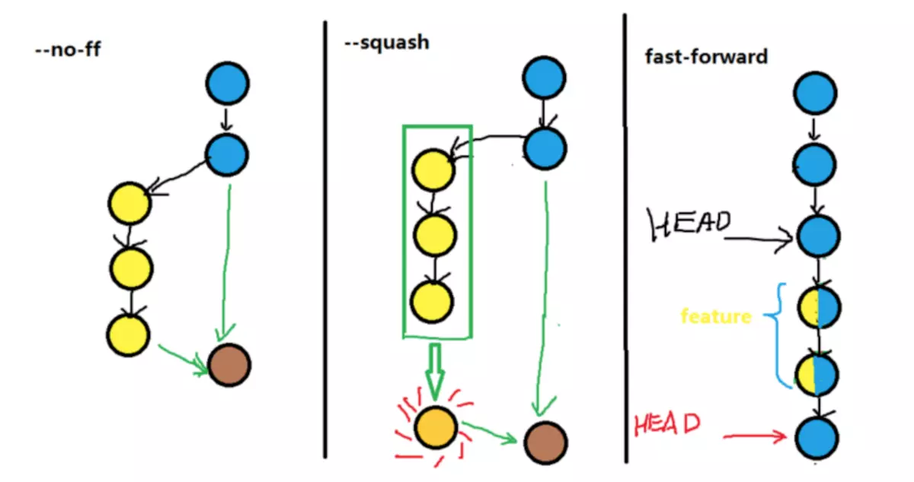

## git merge

是将指定分支合并到当前分支

```git
// 基础操作
git merge <branch>
```

### 基础

**git merge** 默认采用快进（fast-forward）的方式。**如果 merge 的时候没有冲突，没有新的 commit 节点产生，只是移动分支的指针来实现 merge**

### 无节点 merge

> 由于多分支的开发，会导致 merge 节点错综复杂，所以需要无节点merge，即 commit 是一条线，视觉清晰，可读性强。

实现无节点 merge，其实就是使用 merge 的默认特性快进（fast-forward），因为快进不会产生 commit 节点，只会移动分支的 HEAD 指针。

问题是：快进的特性是在没有冲突的情况下产生的，而执行 merge 大概率会产生冲突，这时候就需要使用 **git rebase**

### 有节点 merge

如果 merge 有冲突，解决完冲突后，add 冲突的文件再 commit，就会产生一个 merge 节点。

如果需要强制产生 merge 节点，使用 **--no-ff** 参数强制产生 merge 节点。

no-ff: no-fast-forward

```git
git merge --no-ff -m <merge 节点注释> <branch>
// 产生一个 <merge 节点注释> 的commit节点
```

### 单节点 merge

> 需要将多个 merge 压缩成一个 commit 节点

使用压缩参数：squash，作用是将被 merge 的节点压缩在一起，在 master 分支上只显示一个 commit 节点

```git
git merge --squash <branch>
git commit -m <merge 节点注释>
// 只产生一个 <merge> 的 commit 节点
```



## git rebase

变基（改变基线）：变基的作用就是修整历史，将分支历史并入主线。

注意：不要在 master 分支上这么搞

```
// 之前
m0 -- m1 -- m2 -- m3    master
      |
      b1 -- b2 -- b3    dev

// 之后
m0 -- m1 -- m2 -- m3 -- d
```

```git
git co dev
git rebase -i master
```

原理：

1. 首先找到两个分支 dev 和 master 的最近共同祖先 m1
2. 对比当前 dev 分支相比 m1 的历次提交，提取修改，保存为临时文件
3. 将分支指向 master 的最新 m3
4. 依次应用修改

其中 “依次应用修改” 指的是：

**-i** 参数打开交互界面，在 vim 编辑器中进行操作

