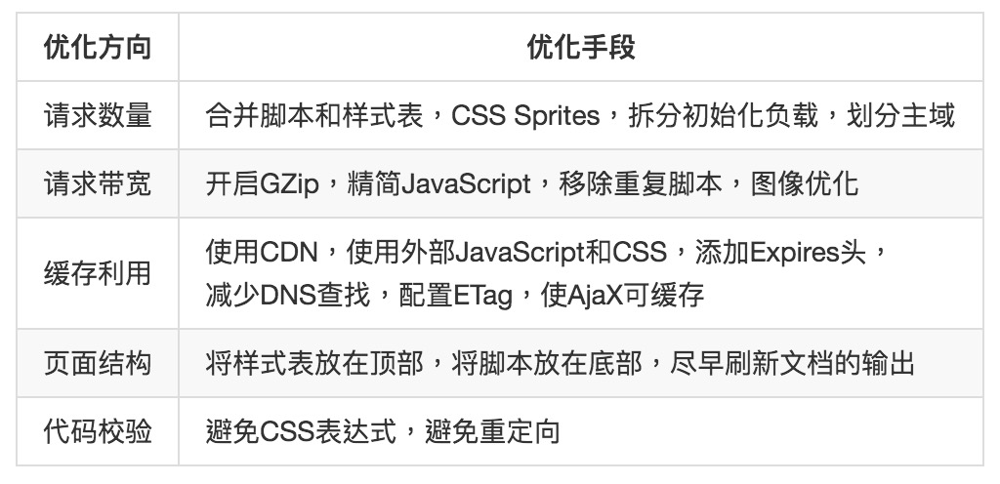

## web 方面的优化

## webpack 优化

#### 1. production 模式自带优化

1. tree shaking

通常用于打包时移除 js 中未引用的代码，它依赖于 ES6 模块系统中的 import 和 export 的 ***静态结构特性***

2. scope hositing

将所有模块的代码按照引用顺序放在一个函数作用域里，然后适当的重命名一些变量以防变量名冲突，但是他依然依赖于 ES6 的 import 和 export

3. 代码压缩

#### css 优化

1. 提取到独立文件中
2. css 压缩

#### js 优化

1. 抽取公共代码
2. 动态导入（懒加载）

#### noParse

在引入第三方模块时，如果该模块不依赖其他模块，则可以将其配置到 noParse，这样 webpack 就不会解析他们的依赖关系

#### IgnorePlugin

在引入一些第三方模块时，如 momentjs、dayjs 时，他们内部会做 i18n (多语言) 处理，所以会包含很多语言包，可以根据项目需要忽略掉不需要的语言包

#### DLLPlugin

对于 Vue、React 这些基本上不会修改的文件，可以通过动态链接库的方式进行构建。DLLPlugin 插件只会构建这些代码一遍，以后的每次构建都只会生成业务代码，，可以提高构建效率。